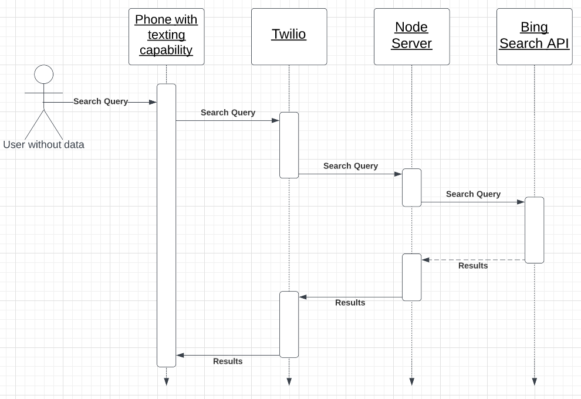

<p align="center">
    
</p>

Text 

```
nodata --help
```

to `(343) 341-6894`

## Architecture

### Stack

#### Node

Our server is written in JavaScript and ran on Node.

#### Twilio

We use Twilio to coordiante SMS sending and receiving.

#### RapidAPI

RapidAPI is used in conjunction with bing web search to search get results for a search on the internet.

#### Docker

We use docker to containerize our app. Containerization allows us to streamline our deploymnet process.

#### Google Cloud

Our Node backend is deployed on **Google Cloud using Google Cloud Run**.

We also use **Google Cloud's Secret Manager** so that we don't expose our API keys.

#### Domain.com

We use a nodataa.tech domain internally. Our domain is registered with domain.com.

### Sequence Diagram

<p align="center">
    
</p>

## Development

### Simulating Production Build

```
Docker build -t . nodata
Docker run -p 3000:3000 nodata
```

Send your requests to localhost:3000.

### Local Development

You probably won't need anything here. But we've left it so that you can see our local development process.

#### Setting up dependencies

```
npm ci
```

#### Running

```
npx nodemon index.js
```

#### Serving local app to the internet

Install [ngrok](https://ngrok.com/), and follow their instructions for serving your local app to the internet. Keep in mind that the app is running on port 3000.

#### Sending Twilio requests to your server

You're going to need a Twilio account to set this up, then follow the steps below.

1. Add a phone number for your acount.
   - Make sure to get a phone number that you can actually text. Our friend [Geordy](https://github.com/Geordy-Decena) originally set us up with a U.S. phone number. We will not be participating in another hackathon with him.
2. Configure the phone number to send a Webhook to `https://your-ngrok-url/sms`. Make sure it's a POST request.

#### RapidAPI Key

Unless you're set up to use our Google Cloud Secrets Manager, you'll need to create your own RapidAPI key to be able to search the web.

Enter this api key in the `options` object in `src/bing-search.js`.

#### Finished!

And that's it! You're done setting up for local development.

